<picture>
  <source media="(prefers-color-scheme: dark)" srcset="dark.svg">
  <source media="(prefers-color-scheme: light)" srcset="light.svg">
  
</picture>

### 👨‍💻 About Me

I'm a passionate technologist who bridges the gap between **artificial intelligence** and **full-stack development**. I build intelligent systems that solve real-world problems, from AI-powered applications to scalable web platforms.

- 🔭 Currently working on **AI-driven applications** and **full-stack projects**
- 🌱 Deepening my expertise in **Python**, **LLMs**, and **cloud architecture**
- 👯 Open to collaborating on **open-source AI/ML projects**
- 💬 Ask me about **AI**, **React**, **Node.js**, or **system design**
- ⚡ Fun fact: I believe clean code and good documentation are art forms

---

### 📊 GitHub Analytics

  
  

  

---

### 🏆 Achievements

  

---

### 🤝 Let's Connect

  
  
  
  
  

---

  
  
  

  <i>⚡ Crafting code with purpose, building with passion.</i>
   
  <b>Let's build something amazing together.</b>

  

